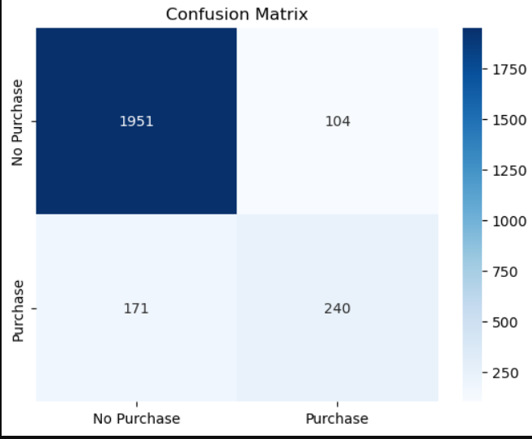
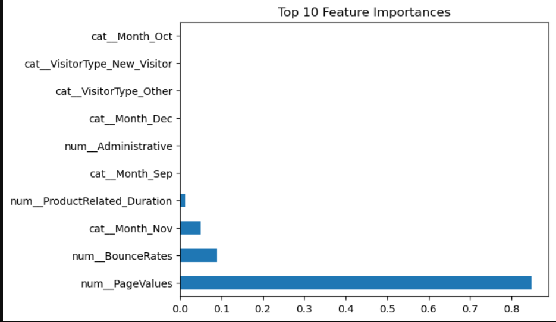
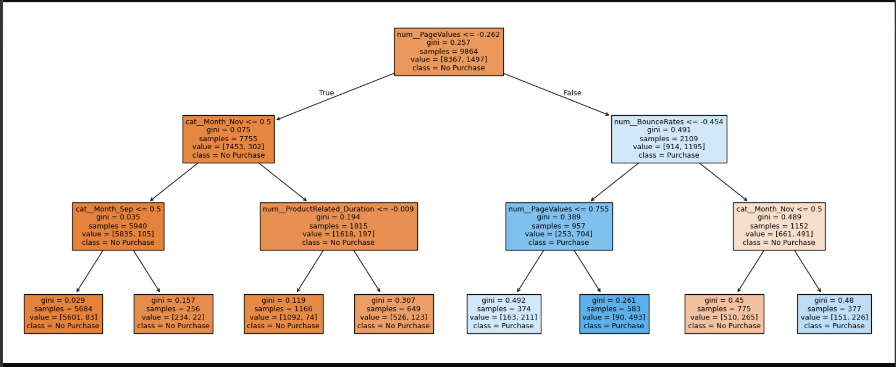

# 🛒 ShopSmart — E-Commerce Purchase Intent Prediction

### Predicting whether an online shopping session ends in a purchase, using a tuned Decision Tree Classifier


---

## 📌 Overview

Online stores lose conversions every day from sessions that *almost* turn into a sale — but never do. This project builds a **Decision Tree Classifier** that predicts, from in-session behavioral signals alone (page counts, time spent, bounce/exit rates, page value, etc.), whether a visitor's session will end in a purchase (`Revenue = True/False`). 

The goal isn't just "get a good score" — it's to build a model that's genuinely **interpretable** (a key reason Decision Trees were chosen over a black-box model first), so a business stakeholder could trace *why* a session was flagged as high purchase-intent. 

> 💡 **Why this matters:** Real-time purchase-intent scoring like this can power exit-intent popups, targeted discounts, or live chat triggers — nudging high-intent sessions across the finish line instead of guessing blindly.

---

## 📊 Dataset

**Source:** [Online Shoppers Purchasing Intention Dataset](https://archive.ics.uci.edu/dataset/468/online+shoppers+purchasing+intention+dataset) (UCI Machine Learning Repository) 
**File used:** `shop_smart_ecommerce.csv` 
**Shape:** `12,330 rows × 18 columns` — zero missing values across the entire dataset. 

| Feature | Type | Description |
|---|---|---|
| `Administrative`, `Administrative_Duration` | numeric | Pages/time spent on account-related pages |
| `Informational`, `Informational_Duration` | numeric | Pages/time spent on informational content |
| `ProductRelated`, `ProductRelated_Duration` | numeric | Pages/time spent on product pages |
| `BounceRates` | numeric | % of visitors who entered and left without triggering another request |
| `ExitRates` | numeric | % of pageviews where this was the last page in the session |
| `PageValues` | numeric | Average value of a page based on contribution to revenue |
| `SpecialDay` | numeric | Closeness of session to a special day (e.g. Valentine's, Mother's Day) |
| `Month` | categorical | Month of the visit |
| `OperatingSystems`, `Browser`, `Region`, `TrafficType` | numeric (coded) | Encoded session metadata |
| `VisitorType` | categorical | New / Returning / Other visitor |
| `Weekend` | boolean → int | Whether the session occurred on a weekend |
| **`Revenue`** | **target** | Did the session end in a purchase? (True/False) |

---

## 🛠️ Tech Stack

- **Language:** Python 3.13
- **Data handling:** `pandas`, `numpy`
- **Visualization:** `matplotlib`, `seaborn`
- **Modeling:** `scikit-learn` — `DecisionTreeClassifier`, `Pipeline`, `ColumnTransformer`, `RandomizedSearchCV`

---

## 🔬 Methodology

### 1. Data Cleaning
- Verified zero missing values across all 12,330 rows.
- Cast `Weekend` and `Revenue` from `bool` → `int` for clean downstream encoding.

### 2. Train/Test Split
```python
X_train, X_test, y_train, y_test = train_test_split(
    X, y, test_size=0.2, random_state=42
)
```
An 80/20 split, stratification-free (a noted improvement area — see below, since `Revenue` is imbalanced).

### 3. Preprocessing Pipeline
Numeric and categorical features are handled separately and combined via `ColumnTransformer`, so the **entire pipeline — preprocessing and model — is one fittable object**. No manual leakage risk between train/test.

```python
numeric_pipeline = Pipeline([('scaler', StandardScaler())])
categorical_pipeline = Pipeline([('encoder', OneHotEncoder(handle_unknown='ignore'))])

preprocessor = ColumnTransformer([
    ('num', numeric_pipeline, num_columns),
    ('cat', categorical_pipeline, cat_columns)
])

pipeline = Pipeline([
    ('preprocessor', preprocessor),
    ('classifier', DecisionTreeClassifier(random_state=42))
])
```

### 4. Why Decision Trees, and how splits are chosen
A Decision Tree recursively splits the data on the feature/threshold that produces the **purest** child nodes, measured by **Gini Impurity**:

$$Gini = 1 - \sum_{i=1}^{n} p_i^2$$

At every node, the tree greedily picks the split that gives the lowest *weighted* Gini across child nodes — this is the **CART** algorithm. Because of this, the resulting tree is fully traceable: every prediction can be explained as a sequence of human-readable if/else conditions, unlike an ensemble or neural net.

### 5. Hyperparameter Tuning — `RandomizedSearchCV`
Rather than grid-searching every combination (expensive), 50 random combinations were sampled across this search space:

```python
param_distributions = {
    "classifier__criterion": ["gini", "entropy"],
    "classifier__max_depth": np.arange(2, 11),
    "classifier__min_samples_split": np.arange(2, 11, 2),
    "classifier__min_samples_leaf": np.arange(1, 11)
}

random_search = RandomizedSearchCV(
    estimator=pipeline,
    param_distributions=param_distributions,
    n_iter=50, cv=5, scoring='f1',
    random_state=42, n_jobs=-1
)
```

**`scoring='f1'` was used instead of accuracy** — `Revenue` is an imbalanced target (most sessions don't convert), so accuracy alone would reward a model that just predicts "No Purchase" every time. F1 forces the model to balance precision and recall on the minority (purchase) class.

---

## 📈 Results

**Best hyperparameters found (5-fold CV, scored on F1):**

| Parameter | Value |
|---|---|
| `criterion` | `gini` |
| `max_depth` | `3` |
| `min_samples_split` | `2` |
| `min_samples_leaf` | `5` |

**Best cross-validated F1 score:** `0.6479`

### Class Balance
```
Revenue
0    84.53%   (No Purchase)
1    15.47%   (Purchase)
```
Confirms the imbalance assumed during model design — this is exactly why `scoring='f1'` was used for tuning instead of accuracy.

### Test Set Performance
| Metric | Score |
|---|---|
| **Test F1 (Purchase class)** | `0.636` |
| **Test Accuracy** | `0.888` |

```
              precision    recall  f1-score   support

No Purchase       0.92      0.95      0.93      2055
   Purchase       0.70      0.58      0.64       411

    accuracy                           0.89      2466
   macro avg       0.81      0.77      0.78      2466
weighted avg       0.88      0.89      0.88      2466
```

CV score (0.648) and test F1 (0.636) are close — **no major overfitting**, the model generalizes consistently.

### Confusion Matrix



| | Predicted: No Purchase | Predicted: Purchase |
|---|---|---|
| **Actual: No Purchase** | 1951 (TN) | 104 (FP) |
| **Actual: Purchase** | 171 (FN) | 240 (TP) |

**Business read:**
- **Precision = 0.70** → when the model flags a session as "Purchase," it's right 70% of the time — good enough to trigger a targeted action (discount popup, retargeting ad) without too many wasted offers.
- **Recall = 0.58** → the model still misses **171 real buyers** (42% of all purchasers), predicting "No Purchase" right up until they bought. This is the model's biggest weakness, and a direct consequence of `max_depth=3` — a shallow tree trades recall for a simple, explainable rule set.

### Feature Importance (Top contributors)



| Feature | Relative Importance |
|---|---|
| `PageValues` | **~84%** — dominant signal, by far |
| `BounceRates` | ~9% |
| `Month_Nov` | ~5% |
| `ProductRelated_Duration` | ~1% |
| All others | negligible (≈0%) |

`PageValues` alone drives the vast majority of the model's decisions — confirms the hypothesis from the EDA discussion. Everything else (categorical month flags, browsing duration) only fine-tunes the prediction at the margins.

### Decision Tree Logic (in plain English)



At `max_depth=3`, the entire model boils down to a readable rulebook:

1. **Root split — `PageValues`:** Sessions with very low `PageValues` are overwhelmingly **No Purchase** (8,367 vs 1,497 in that branch). This single split does most of the work.
2. **Within low-PageValues sessions:** `Month = November` and `ProductRelated_Duration` matter slightly — Nov sessions (likely Black Friday season) skew a bit less "No Purchase" than other months, but the branch stays dominated by non-buyers either way.
3. **Within higher-PageValues sessions:** `BounceRates` becomes the deciding factor. Low bounce + high page value → **strongly Purchase** (90 vs 493 samples in the most confident leaf). High bounce, even with decent `PageValues`, splits roughly 50/50 — these are the "browsed but didn't commit" sessions, exactly where the model's recall struggles.

This confirms the tree learned a genuinely sensible business rule: **engagement value (`PageValues`) first, exit/bounce behavior second** — without ever being told that explicitly.

---


## 🧠 Key Takeaways

- Built a fully leak-safe `Pipeline` + `ColumnTransformer` workflow — preprocessing and model tuning happen inside one object, fit only on training data.
- Chose `scoring='f1'` deliberately to handle class imbalance, rather than defaulting to accuracy — confirmed necessary once class balance came back at 84.5% / 15.5%.
- CV score (0.648) and test F1 (0.636) tracked closely — the model generalizes, it isn't overfit to the training folds.
- `PageValues` alone accounts for ~84% of the model's decision-making — a single engineered/tracked metric carrying almost the entire predictive signal is a useful lesson in where to focus feature engineering effort on future projects.
- The model trades **recall for simplicity**: at `max_depth=3` it's fully human-readable, but misses 42% of actual buyers. This is a direct, quantifiable look at the bias-variance tradeoff, and the natural next step (Random Forest, deeper tree, or threshold tuning) is now motivated by a real number instead of a guess.

---

## 👤 Author

**Vikas Ajay Vishwakarma**
BSc IT Student | Aspiring Data Scientist
🔗 [GitHub](https://github.com/codewithvikas96-ui) · [LinkedIn](#) · [Fiverr](#)

---

⭐ If this project helped you understand Decision Trees or pipeline design, consider starring the repo!
